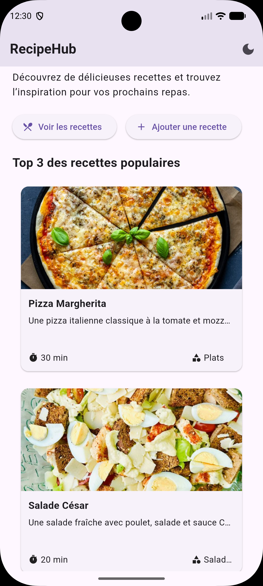
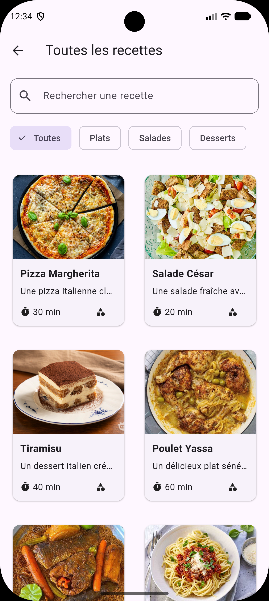
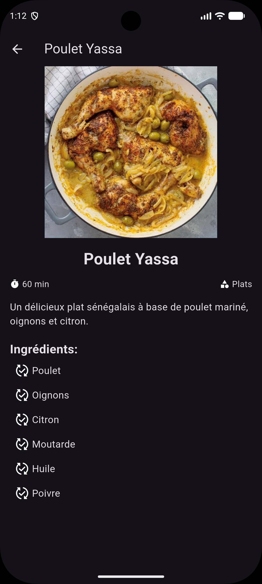

# 🍽️ RecipeHub

RecipeHub est une application Flutter de découverte et de gestion de recettes de cuisine.

L'application permet de parcourir des recettes, rechercher et filtrer des recettes par catégorie, consulter leurs détails et ajouter de nouvelles recettes grâce à un formulaire avec validation.

Ce projet a été réalisé dans le cadre d'une certification Flutter portant sur les fondamentaux des widgets, la navigation et la création d'une application multi-écrans.

---

## 📱 Aperçu

### Accueil

L'écran d'accueil présente l'application et propose un accès rapide aux principales fonctionnalités ainsi qu'aux recettes populaires.



---

### Liste des recettes

Les recettes sont affichées sous forme de grille.

Fonctionnalités :

- Recherche d'une recette par son nom
- Filtrage par catégorie
- Recherche et filtrage simultanés
- Message lorsqu'aucune recette ne correspond
- Grille responsive adaptée aux différentes tailles d'écran



---

### Détail d'une recette

Chaque recette possède un écran de détail présentant :

- L'image de la recette
- Le nom
- La description
- La catégorie
- Le temps de préparation
- La liste des ingrédients



---

### Ajouter une recette

L'application permet également de créer une nouvelle recette grâce à un formulaire.

Fonctionnalités :

- Validation des champs
- Saisie du nom et de la description
- Saisie de la catégorie
- Ajout d'une URL d'image
- Saisie du temps de préparation
- Ajout dynamique des ingrédients
- Suppression des ingrédients
- Ajout de la nouvelle recette à la liste


---

### 🌗 Thème clair et sombre

RecipeHub prend en charge les deux thèmes :

- Mode clair
- Mode sombre


---

## ✨ Fonctionnalités principales

| Fonctionnalité | Description |
|---|---|
| 🏠 Accueil | Présentation de l'application et recettes populaires |
| 🔎 Recherche | Recherche de recettes par titre |
| 🏷️ Filtrage | Filtrage des recettes par catégorie |
| 📖 Détails | Consultation des informations complètes d'une recette |
| ➕ Ajout | Création de nouvelles recettes |
| ✅ Validation | Validation des données saisies dans le formulaire |
| 🌗 Thème | Mode clair et mode sombre |
| 📱 Responsive | Adaptation de l'interface aux différentes tailles d'écran |
| 🧭 Navigation | Navigation entre les écrans avec GoRouter |

---

## 🔎 Recherche et filtrage

L'écran des recettes permet de combiner une recherche textuelle avec un filtre par catégorie.

Par exemple :

```text
Recherche : poulet
Catégorie : Plats