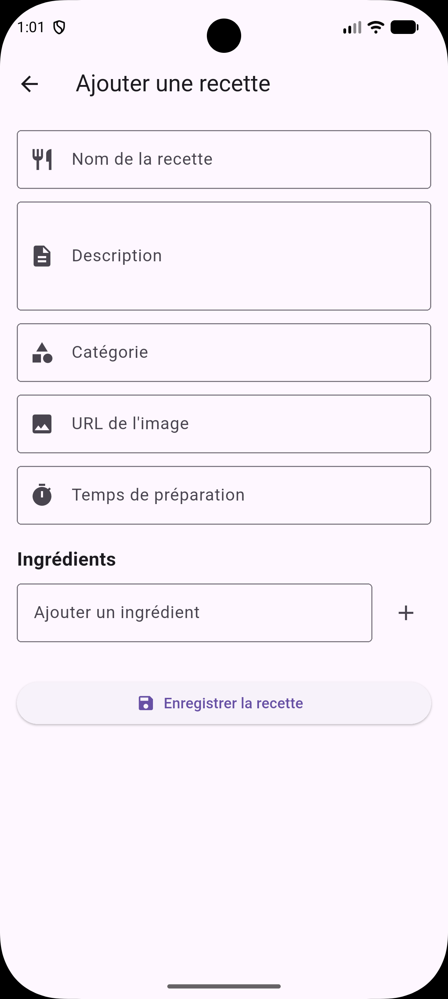

# 🍽️ RecipeHub

RecipeHub est une application mobile Flutter de découverte et de gestion de recettes de cuisine.

L'application permet de parcourir des recettes, de rechercher et filtrer des recettes par catégorie, de consulter les détails d'une recette et d'en ajouter de nouvelles grâce à un formulaire avec validation.

Ce projet a été réalisé dans le cadre d'une certification Flutter portant sur les fondamentaux des widgets, la navigation et la construction d'une application multi-écrans.

---

## 📱 Aperçu

RecipeHub propose une interface simple et intuitive permettant de :

- Découvrir des recettes populaires
- Parcourir l'ensemble des recettes
- Rechercher une recette par son nom
- Filtrer les recettes par catégorie
- Consulter les détails d'une recette
- Ajouter une nouvelle recette
- Ajouter et supprimer dynamiquement des ingrédients
- Utiliser l'application en mode clair ou sombre
- S'adapter aux différentes tailles d'écran

---

## ✨ Fonctionnalités

### 🏠 Accueil

L'écran d'accueil permet de découvrir rapidement l'application.

- Présentation de RecipeHub
- Accès à la liste des recettes
- Accès au formulaire d'ajout d'une recette
- Affichage des 3 recettes populaires
- Navigation vers les détails d'une recette


---

### 🍴 Liste des recettes

L'écran principal des recettes affiche les recettes sous forme de grille.

Fonctionnalités :

- Affichage des recettes sous forme de `GridView`
- Recherche par nom
- Filtrage par catégorie
- Combinaison de la recherche et du filtrage
- Message lorsqu'aucune recette ne correspond
- Navigation vers le détail d'une recette
- Adaptation du nombre de colonnes selon la taille de l'écran


---

### 🔎 Recherche et filtrage

La recherche permet de retrouver une recette à partir de son titre.

Le filtrage permet de sélectionner une catégorie :

- Toutes
- Plats
- Salades
- Desserts
- etc.

Les deux fonctionnalités peuvent être utilisées simultanément.

Exemple :

```text
Recherche : poulet
Catégorie : Plats
```

Le système retourne uniquement les recettes correspondant aux deux critères.

---

### 📖 Détail d'une recette

Chaque recette possède un écran de détail accessible depuis les cartes de recettes.

L'écran affiche :

- Image de la recette
- Nom
- Description
- Catégorie
- Temps de préparation
- Liste des ingrédients

La recette sélectionnée est transmise à l'écran de détail avec `GoRouter`.


---

### ➕ Ajouter une recette

L'application permet d'ajouter une nouvelle recette grâce à un formulaire.

Le formulaire contient plusieurs champs avec validation :

- Nom de la recette
- Description
- Catégorie
- URL de l'image
- Temps de préparation
- Ingrédients

Les ingrédients peuvent être :

- ajoutés dynamiquement
- affichés sous forme de `Chip`
- supprimés individuellement

Une validation empêche l'enregistrement d'une recette incomplète.



---

### 🌙 Thème clair et sombre

L'application prend en charge les deux modes d'affichage :

- ☀️ Mode clair
- 🌙 Mode sombre


---

## 🧭 Navigation

La navigation de l'application est réalisée avec **GoRouter**.

Les principales routes sont :

| Route | Écran |
|---|---|
| `/` | Accueil |
| `/recipes` | Liste des recettes |
| `/add-recipe` | Ajouter une recette |
| `/recipe` | Détail d'une recette |

La recette sélectionnée est transmise à l'écran de détail lors de la navigation.

---

## 📱 Responsive Design

L'interface de la liste des recettes s'adapte à la taille de l'écran.

Le nombre de colonnes de la grille est automatiquement ajusté :

| Taille d'écran | Colonnes |
|---|---:|
| Mobile | 2 |
| Tablette | 3 |
| Grand écran | 4 |

Cette adaptation est réalisée à partir de la largeur disponible avec `MediaQuery`.

---

## 🧩 Widgets réutilisables

Plusieurs composants ont été séparés dans le dossier `widgets/` afin d'éviter de dupliquer le code.

### `RecipeCard`

Widget permettant d'afficher une recette sous forme de carte.

### `SearchbarWidget`

Widget réutilisable permettant de saisir une recherche.

Il utilise :

```dart
ValueChanged<String>
```

pour transmettre la valeur saisie à l'écran parent.

### `CategoryChip`

Widget permettant d'afficher une catégorie et de gérer son état sélectionné.

---

## 🧪 Tests

Le projet contient des tests unitaires portant notamment sur le système de recherche et de filtrage.

Les tests vérifient par exemple :

- La recherche d'une recette par son titre
- Le filtrage par catégorie
- L'absence de résultat
- La recherche insensible à la casse

Pour exécuter les tests :

```bash
flutter test
```

---

## 🏗️ Architecture du projet

Le projet utilise une organisation par responsabilités afin de séparer les données, les modèles, les écrans, les widgets, les routes et la logique métier.

```text
recipes_hub_for_ffsc/
│
├── lib/
│   │
│   ├── data/
│   │   └── recipe_data.dart
│   │
│   ├── models/
│   │   └── recipe.dart
│   │
│   ├── routes/
│   │   └── routes.dart
│   │
│   ├── screens/
│   │   ├── home_screen.dart
│   │   ├── recipes_screen.dart
│   │   ├── recipe_detail_screen.dart
│   │   └── add_recipe_screen.dart
│   │
│   ├── services/
│   │   └── recipe_filter.dart
│   │
│   ├── widgets/
│   │   ├── recipe_card.dart
│   │   ├── search_bar.dart
│   │   └── category_chip.dart
│   │
│   └── main.dart
│
├── screenshots/
│   ├── home.png
│   ├── recipes.png
│   ├── detail.png
│   ├── add_recipe.png
│   └── dark_mode.png
│
├── test/
│   └── recipe_filter_test.dart
│
├── pubspec.yaml
├── analysis_options.yaml
└── README.md
```

---

## 🛠️ Technologies utilisées

- **Flutter**
- **Dart**
- **Material 3**
- **GoRouter**
- **flutter_test**

---

## 🧠 Concepts Flutter et Dart utilisés

Ce projet m'a permis de mettre en pratique plusieurs concepts :

### Flutter

- `StatelessWidget`
- `StatefulWidget`
- Gestion de l'état avec `setState`
- `Form` et `FormState`
- `TextFormField`
- Validation de formulaires
- `TextEditingController`
- `ListView`
- `GridView`
- `Card`
- `Chip`
- `Wrap`
- `SingleChildScrollView`
- `MediaQuery`
- Responsive Design
- Thèmes clair et sombre
- Widgets personnalisés et réutilisables

### Dart

- Classes
- Constructeurs
- Types `String`, `int`, `List`
- Collections
- Méthodes `map`, `where`, `take`
- Fonctions anonymes
- Getters
- Null safety
- `async` / navigation Flutter
- Organisation du code par responsabilités

---

## 🔎 Exemple de filtrage

La logique de filtrage est séparée de l'interface utilisateur dans le service `RecipeFilter`.

```dart
final result = filterService.filter(
  recipes: recipes,
  searchQuery: "Pizza",
  selectedCategory: "Toutes",
);
```

La recherche est également insensible à la casse.

Par exemple :

```text
pizza
PIZZA
Pizza
PiZzA
```

permettent toutes de rechercher le même résultat.

---

## 🚀 Installation

### 1. Cloner le projet

```bash
git clone https://github.com/yamariel/recipes_hub_for_ffsc.git
```

### 2. Entrer dans le projet

```bash
cd recipes_hub_for_ffsc
```

### 3. Installer les dépendances

```bash
flutter pub get
```

### 4. Lancer l'application

```bash
flutter run
```

### 5. Exécuter les tests

```bash
flutter test
```

---

## 📋 Prérequis

Pour lancer le projet, vous devez disposer de :

- Flutter SDK
- Dart SDK
- Android Studio ou Visual Studio Code
- Un émulateur Android/iOS ou un appareil physique

Vérifier votre installation Flutter :

```bash
flutter doctor
```

---

## 🎯 Objectifs pédagogiques

Ce projet avait pour objectif de mettre en pratique :

- La construction d'une application Flutter multi-écrans
- La maîtrise des widgets Flutter
- La création de widgets réutilisables
- La navigation entre plusieurs écrans
- Le passage de données entre les écrans
- La création et validation de formulaires
- La recherche et le filtrage de données
- Le responsive design
- La gestion des thèmes
- L'écriture de tests unitaires
- L'organisation d'un projet Flutter

---

## 👨‍💻 Auteur

**Ariel Yamien**

- GitHub : [github.com/yamariel](https://github.com/yamariel)
- LinkedIn : [linkedin.com/in/ariel-yamien](https://www.linkedin.com/in/ariel-yamien/)

---

## 📄 Certification

Projet réalisé dans le cadre d'une certification Flutter consacrée aux fondamentaux des widgets, à la navigation et au développement d'une application multi-écrans.

---